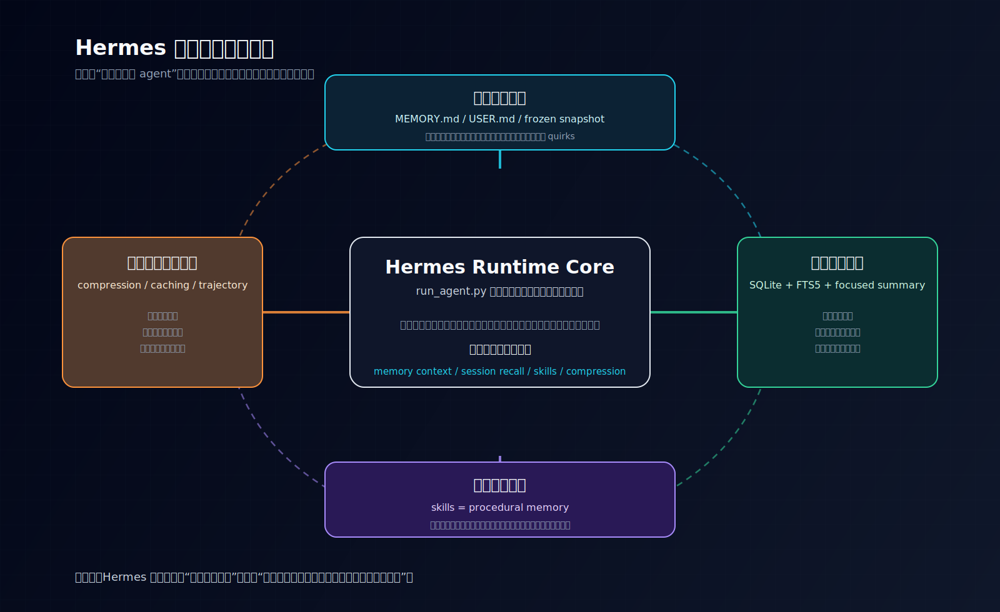

# 为什么 Hermes 不是“有记忆的 agent”，而是“能持续积累自己的 agent”

## 先回答读者最容易问错的那个问题

很多人第一次看 Hermes，会先把它理解成一个“带记忆的 agent 框架”：它有工具调用、有 CLI 和 gateway，也有 memory、skills、定时任务与多代理协作。

这种理解不能算错，但不足以解释 Hermes 真正有辨识度的地方。

Hermes 更像这样一套系统：

- 这次对话里记住了用户偏好和环境事实
- 下次遇到相似问题时，会把相关旧会话先找回来再压成当前可用的回忆
- 这次成功的方法不会只留在聊天记录里，而会进一步沉淀成 skill
- 对话越来越长时，它还会主动压缩上下文，避免历史反过来拖垮自己

所以这篇真正要先立住的判断只有一句：

> **Hermes 最独特的地方，不在于“它也有记忆”，而在于它把记忆、会话回忆、技能沉淀与上下文自优化接成了一套会持续积累自己的系统闭环。**

如果这个判断先没立住，后面你再看 `run_agent.py`、`model_tools.py`、`cli.py`、`gateway/`，就会一直像在看一个“功能很多的 agent 项目”；而不是在看一套**会不断整理并复用自己经验的系统**。

---

## 先界定“自我进化”的含义

本文所说的“自我进化”，并不是指模型在运行过程中修改参数、自动微调，或以在线强化学习的方式持续提升底层能力。就 Hermes 当前源码体现的机制而言，它讨论的是另一层含义：**系统级增长（system-level growth）**。

所谓系统级增长，是指底层模型和基本的 tool loop 可以保持不变，但系统会逐步形成更强的经验处理能力：

- 把稳定事实持久化保存
- 在需要时召回与当前任务相关的历史会话
- 将成功做法沉淀为可复用技能
- 对过长上下文进行压缩和缓存，使长期运行仍然可持续

因而，Hermes 的“变强”不是“模型学到了更多”，而是**系统越来越擅长组织、调用和复用自己的过去经验**。

这一定义决定了本文后续的分析重点：我们关注的不是单次任务如何完成，而是一次任务完成后，哪些能力会被留到下一次继续使用。

---

## 一、先看最小总图：Hermes 的变强，不是一条线，而是四条闭环

如果把 Hermes 里最像“持续变强”的部分压成最低分辨率模型，可以先看这四条线：



看这张图时，建议按这个顺序读：

- 先看中间的 `Hermes Runtime Core`，确认这四条线最后都会重新接回主体循环
- 再看上、右、下、左四个盒子，确认它们分别回答“记住什么 / 想起什么 / 学会什么 / 怎样不被历史拖垮”
- 最后再看环形虚线，确认 Hermes 的差异不在单个 feature，而在这些机制被接成了一个长期运行闭环

1. **持久记忆闭环**
2. **会话回忆闭环**
3. **技能沉淀闭环**
4. **上下文自优化闭环**

如果只想先抓住这四条线怎样接起来，可以先看最小流程：

```text
这次任务发生
  → 稳定事实写入 memory
  → 任务过程进入 session store
  → 成功方法沉淀成 skill
  → 长历史被压缩和缓存
  → 下一次相似任务再召回这些经验
```

这四条线分别回答的是不同问题。

### 1. 持久记忆闭环：系统怎样稳定记住事实
这条线的核心文件是：

- `tools/memory_tool.py`
- `agent/builtin_memory_provider.py`
- `agent/memory_manager.py`

它解决的问题不是“当前回复里临时记一句话”，而是：

- 用户有哪些稳定偏好
- 当前环境有哪些重要事实
- 项目有哪些长期约定
- 哪些工具 quirks 应该在以后继续记住

也就是说，这一层处理的是：

> **未来多次会话都还值得继续携带的稳定事实。**

### 2. 会话回忆闭环：系统怎样在需要时把过去经验调回来
这条线的核心文件是：

- `hermes_state.py`
- `tools/session_search_tool.py`

它解决的不是“固定记忆”，而是另一类问题：

- 之前我们是不是处理过类似问题
- 上次怎么做的
- 哪些文件、命令、错误信息值得重新调回来
- 当下这次任务最相关的那段过去经验是什么

这一层其实更像：

> **情境回忆，而不是长期事实记忆。**

### 3. 技能沉淀闭环：系统怎样把“知道”变成“会做”
这条线的核心文件是：

- `tools/skill_manager_tool.py`
- `agent/skill_commands.py`
- `agent/skill_utils.py`
- `tools/skills_tool.py`

这里最值钱的一句定义，其实源码已经直接写出来了：

> **Skills are the agent's procedural memory.**

也就是说，Hermes 不满足于“记住一个事实”，它还要把成功方法写成之后可复用的做法。

这是第三层闭环：

- 这次会做了
- 不是只留下印象
- 而是沉淀成正式技能
- 下次可以直接拿出来复用

### 4. 上下文自优化闭环：系统怎样不被自己的历史压垮
这条线的核心文件是：

- `agent/context_compressor.py`
- `agent/prompt_caching.py`
- `agent/trajectory.py`

这一层不是“记住更多”，而是：

- 怎么压缩长对话
- 怎么保留最该保留的头尾
- 怎么把中段历史总结成还能继续工作的形式
- 怎么让多轮成本变低
- 怎么把经验资产存下来

也就是说，Hermes 不只是积累经验，它还会：

> **主动把经验整理成更低成本、更可持续运行的形式。**

---

## 二、为什么这四条线加在一起，才构成 Hermes 的真正差异

如果只看其中一条，你很容易觉得这没什么特别：

- 有记忆的 agent 很常见
- 有历史搜索的 agent 也不少
- 有 skills 的系统也见过
- 有 context compression 的实现也不稀奇

Hermes 真正有意思的地方，不是“它有这些功能”，而是：

> **它把这些东西接成了一个互相补位的闭环。**

更具体地说：

### 1. Memory 负责沉淀稳定事实
`tools/memory_tool.py` 开头就把这个边界说得很清楚：

- `MEMORY.md` 记录环境事实、项目约定、工具 quirks、学到的东西
- `USER.md` 记录用户偏好、沟通风格、工作习惯

这已经说明，Hermes 的 memory 不是“再多存一点聊天内容”，而是在做一种**稳定事实层**。

### 2. Session recall 负责把过去会话重构成当前可用经验
`tools/session_search_tool.py` 的 flow 也很直接：

1. FTS5 搜匹配消息
2. 按 session 分组
3. 抽出相关 transcript
4. 再让便宜模型做 focused summary
5. 返回的是回忆摘要，而不是原始 transcript

这说明 Hermes 不只是“能检索历史”，而是：

> **会先检索，再重构，再把过去经验以当前真正能用的形式拿回来。**

### 3. Skill 负责把成功做法固定成 procedural memory
`tools/skill_manager_tool.py` 直接区分了两类东西：

- memory = broad / declarative
- skills = narrow / actionable

这意味着 Hermes 在明确回答另一个问题：

- 事实要怎么记
- 做法要怎么学

很多 agent 会停在前者。Hermes 进一步做了后者。

### 4. Compression / caching 负责让“越积越多”不会变成“越积越重”
`agent/context_compressor.py` 的算法说明也很直白：

1. 先裁剪旧 tool output
2. 保护 head
3. 保护 tail
4. 总结 middle turns
5. 多次 compaction 时做迭代式 summary update

这套设计说明 Hermes 的目标不是“把所有历史都塞进 prompt”，而是：

> **把历史压成还够继续工作的样子。**

所以 Hermes 的差异，不是“四个 feature 并列摆着”，而是这四层在回答同一个更大的问题：

> **系统怎样在长期运行中越来越会利用自己的过去。**

---

## 三、`run_agent.py` 之所以要放到最后看，就是因为它不是入口问题，而是汇合问题

如果第一次读 Hermes 就先扑进 `run_agent.py`，你当然会看到很多关键结构：

- tool calling loop
- iteration budget
- prompt building
- context compression 接入点
- memory manager 接入点
- trajectory 保存

但问题在于，这样读很容易把 Hermes 理解成：

> “一个功能很多的主循环”

而错过真正重要的问题：

> **这些 memory / recall / skill / compression，到底为什么会一起出现在这里？**

`run_agent.py` 顶部的导入本身就已经说明了这件事：

- `build_memory_context_block`
- `ContextCompressor`
- `apply_anthropic_cache_control`
- `save_trajectory`

这些并不是一些零散增强，而是整套“经验处理系统”重新接回主体 loop 的入口。

也就是说，`run_agent.py` 在这一组文章里更适合被理解成：

> **四条自我进化闭环的汇合点**

而不是入口篇本身。

这也是为什么这组导读不应该从 `run_agent.py` 起手。

---

## 四、这一组为什么比 CLI、gateway、tool calling 更值得先读

这不是说 CLI、gateway、tool calling 不重要。

而是说，如果你想从 Hermes 里学最值钱、最不像通用 agent 模板的部分，那优先级应该先放在这里：

- 记住什么
- 想起什么
- 学会什么
- 怎样不被自己的历史拖死

原因很简单。

### 1. CLI / gateway 是暴露面
它们回答的是：

- Hermes 怎样被人和平台使用
- 怎样被 CLI、Telegram、Feishu、Discord 之类接住

### 2. Tool calling 是执行面
它回答的是：

- 模型怎样发起调用
- 系统怎样把调用落成真实动作

### 3. 但 memory / recall / skill / compression 回答的是“成长面”
它们回答的是更上层的问题：

- 为什么这次做过的事，下次能更顺
- 为什么用户不用一遍遍重复偏好
- 为什么过去解决过的问题，系统还能想起来
- 为什么成功方法不会随着会话结束就蒸发

如果你只学执行面，你学到的是“它怎么工作”。
如果你先学成长面，你学到的是：

> **它为什么会越跑越像一个会积累自己的系统。**

这正是 Hermes 最值得读的地方。

---

## 小结

到这里可以先得到一个足够明确的结论：Hermes 所谓的“自我进化”，不是模型层的在线学习，而是系统层的经验积累机制。持久记忆负责保存稳定事实，会话回忆负责调回相关经验，技能系统负责沉淀可复用做法，上下文压缩则保证这些积累不会反过来压垮系统运行。

这四部分并不是彼此独立的 feature，而是一套共同服务于长期运行的闭环设计。

---

## 结论：为什么 Hermes 不应被概括为“有记忆的 agent”

如果只从工具调用、CLI、gateway 或调度能力来看，Hermes 确实可以被归入“功能完整的 agent 框架”。但这样的概括仍然过于粗糙，因为它没有解释 Hermes 在长期运行上的核心设计：**如何把过去的任务、事实、方法和上下文处理结果，转化为下一次运行仍可使用的能力。**

因此，更准确的说法不是“Hermes 是一个有记忆的 agent”，而是：**Hermes 试图把 agent 做成一个能够持续积累自身经验的系统。**

后续阅读也应围绕这一点展开：先看记忆、回忆、技能和上下文压缩如何分别成立，再回到 `run_agent.py` 看它们如何被接回主循环。

---

## 系列内继续阅读

- 这是本组起点，建议先顺着往下读。
- 回到阅读入口：`2026-04-16-Hermes-自我进化阅读路线图-v1.md`
- 如果你想看这组文章为什么这样排：`2026-04-17-Hermes-特色与不同点系列规划-v1.md`
- 下一篇：`02-从主循环看-Hermes-与-coding-agent-有什么不同.md`

