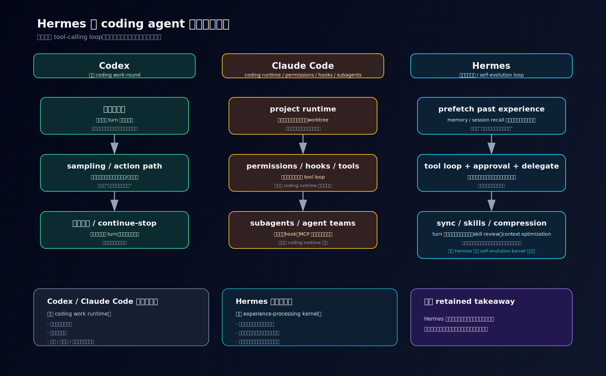

# 从主循环看，Hermes 与 coding agent 有什么不同

## 先回答读者最容易问错的那个问题

如果只从表面看，Hermes、Codex、Claude Code 都像“会调用工具的 agent”：

- 用户给一个任务
- 系统进入主循环
- 模型决定要不要调用工具
- 工具执行完再回来继续
- 最后收口成一段结果

如果只看到这一层，你很容易得出一个结论：

> 它们的主循环其实差不多，只是工具集合和产品包装不同。

这正是这篇要先纠正的误解。

更准确的判断是：

> **Hermes、Codex、Claude Code 当然都有主循环，但它们把“什么东西当成主循环真正要维持的对象”这件事做得并不一样。**

- **Codex** 更像在维持一轮 coding work-round：当前工作面、sampling、action path、结果回流、continue/stop。
- **Claude Code** 更像在维持一套 coding runtime：执行、权限、项目规则、hooks、subagents 都围绕代码工作流布置。
- **Hermes** 则更像在维持一套经验处理内核：memory、session recall、skills、compression 这些能力直接接进主体循环，目的是让系统越跑越会利用自己的过去。

所以这篇真正想回答的不是：

> “三家谁的 loop 更复杂？”

而是：

> **为什么 Hermes 的主循环更值得从“自我进化”视角去读，而 Codex / Claude Code 更值得从“coding work runtime”视角去读？**

---

## 先把比较标准压清：主循环到底在维持什么

讨论主循环差异时，最容易犯的错，是直接比 while loop 长什么样、tool call 长什么样。

但那种比较层次太低。

更有价值的比较标准应该是：

1. **主循环真正维持的对象是什么**
2. **工具调用在主循环里处于什么位置**
3. **历史与经验是被当成执行材料，还是被当成长期资产**
4. **一轮结束之后，系统会把什么东西留给下一轮**

按这个标准去看，三者的差异就很清楚了。



看这张图时，建议按这个顺序读：

- 先横向看三列标题，确认三者虽然都有 loop，但各自主循环真正要维持的对象不同
- 再纵向看每一列从上到下的推进，确认 Codex / Claude Code 更像 coding runtime，而 Hermes 更像经验处理内核
- 最后看底部三张总结卡，把“当前任务怎样推进”和“过去经验怎样留下”这两个问题彻底分开

---

## 一、Codex 的主循环：把当前 coding work-round 做完

先看 Codex。

从现有 guidebook 和源码链路看，Codex 的主循环最核心的对象不是长期经验，而是：

> **当前 turn 里的工作面，以及这轮工作怎样继续推进到收口。**

它的低分辨率主线大致是：

```text
用户输入
  → 组织当前工作面
  → sampling
  → 判断是直接回答还是进入 action / tool path
  → 工具执行
  → 结果回流当前 turn
  → 再次 sampling
  → 直到当前结果足够收口
```

这里最关键的几个点是：

### 1. 主循环关心的是“这一轮工作怎么做完”
Codex 的 runtime 重点在：

- 当前工作面怎样组织出来
- 一次 sampling 是不是已经足够收口
- 还是要进入 action / tool path
- 结果怎样重新变成下一次 sampling 的输入

也就是说，Codex 的 loop 是围绕**当前工作回合**组织的。

### 2. 结果回流的意义，是把任务继续做下去
Codex 当然也会保留历史，但它的“结果回流”重点不是经验沉淀，而是：

> **让同一轮任务继续往下推进。**

tool result 必须回到当前 turn，重新成为下一次模型判断输入。

所以它的闭环更像：

> **任务执行闭环**

而不是：

> **经验沉淀闭环**

### 3. continue / stop 看的是“当前任务是否已足够收口”
Codex 的 continue/stop 不是看“有没有做动作”，而是看：

- 当前结果够不够支持收口
- 不够就继续
- 够了才停

这是一种非常典型的 coding agent 气质：

> **它更像一个会在当前工作现场持续推进代码任务的系统。**

---

## 二、Claude Code 的主循环：维持一套 coding runtime

再看 Claude Code。

如果说 Codex 的核心对象是“一轮 coding work-round”，那 Claude Code 的主体更像：

> **一套围绕代码工作流组织起来的 runtime。**

它当然也有模型回合、工具调用、继续与停止。
但它主循环周围的一等公民，明显更偏这些东西：

- 工具执行前的 permission / hook
- 项目规则文件（如 `CLAUDE.md`）
- worktree / 目录边界
- agent teams / subagents
- coding runtime 中的环境与控制结构

也就是说，Claude Code 最强的那一层不是“怎么积累自己的过去经验”，而是：

> **怎样把 coding agent 的执行、权限、项目规则和子代理组织成一套稳定 runtime。**

### 1. 它把执行边界与权限控制做成了主循环外围的正式层
Claude Code 里的 permission、allowed/disallowed tools、hooks，不像“顺手加的安全检查”。

它们更像 coding runtime 的正式治理层：

- 哪些工具能进主链
- 哪些动作要先过权限判断
- 哪些执行后要跑 lint / format / post hook

所以 Claude Code 的 loop 不是孤立的模型循环，而是被这套 runtime 治理结构包着的。

### 2. 它更重视“当前代码工作怎样被组织”
Claude Code 对这些事情非常敏感：

- 当前工作目录
- project memory / 项目规则
- extra dirs / worktree
- subagent 的协作位置

这说明它主循环更像在维持：

> **一个能持续做 coding work 的运行时环境。**

### 3. 它当然有 memory，但 memory 不是它最有辨识度的主循环中心
Claude Code 也有项目级记忆、规则、上下文文件。

但整体上，它给人的感觉仍然是：

> **主循环先服务于代码工作流；记忆和规则更多是附着在 coding runtime 上。**

这和 Hermes 的顺序恰好不同。

---

## 三、Hermes 的主循环：把经验处理直接做成内核

Hermes 最值得注意的地方就在这里。

如果你只从 `run_agent.py` 表面看，它当然也像一个标准 tool-calling loop：

- 组 prompt
- 发模型请求
- 处理 tool calls
- 写回 tool results
- 直到没有新的 tool call 为止

但真正拉开差距的，不是这层表面，而是主循环里直接挂着的那些东西：

- `build_memory_context_block`
- `ContextCompressor`
- `apply_anthropic_cache_control`
- `save_trajectory`
- memory manager 的 prefetch / sync / queue_prefetch
- turn 结束后的 background review，用来决定要不要写 memory / skill

也就是说，Hermes 的主循环真正维持的对象，不只是“这轮任务做没做完”，而是：

> **这轮任务结束后，哪些经验会被系统留下来，并在下一轮继续使用。**

这就是 Hermes 和前两者最根本的差异。

---

## 四、Hermes 为什么更像“经验处理内核”

如果要把 Hermes 的主循环压成最低分辨率模型，可以先看这张不同于 Codex 的链条：

```text
用户输入
  → memory/session recall 先预取
  → 组装当前 prompt 与临时经验上下文
  → 进入 agent loop / tool dispatch
  → 必要时 approval / delegate / tool execution
  → turn 结束后 sync memory
  → queue next prefetch
  → background review 决定是否沉淀 memory / skill
  → 长对话再进入 compression / caching / trajectory
```

和 Codex 相比，区别很明显：

- **Codex**：重点在当前任务怎样推进
- **Hermes**：重点在当前任务怎样被处理成未来还能继续使用的经验

### 1. 经验在主循环前就先被接入
Hermes 的 memory / recall 不是回合结束后才考虑的附加功能。

在 `run_agent.py` 里，memory manager 会在正式循环前做：

- `prefetch_all()`
- `build_memory_context_block()`

这意味着：

> **Hermes 在当前回合开始前，就先把“过去经验”当成工作材料接进来了。**

这和 Codex 的“当前工作面”不同。
Codex 的工作面重点是本轮任务材料；Hermes 则把“过去经验”显式地纳入当前轮输入面。

### 2. 经验在回合结束后还会继续被加工
Hermes 的结束不是“输出完就完了”。

一轮结束后，它还会做：

- `sync_all()`
- `queue_prefetch_all()`
- background review

尤其 background review 很关键。

因为它说明 Hermes 不满足于“这轮跑完”，而是会进一步追问：

- 有没有值得记进 memory 的事实
- 有没有值得沉淀成 skill 的做法
- 有没有东西该为下次预热 recall

这一点已经不是普通 tool loop 了，而是一种：

> **事后反思并沉淀经验的系统行为。**

### 3. 经验不会无限堆积，而会被继续压缩和缓存
Hermes 不是单纯“越记越多”。

它还有完整的：

- context compression
- prompt caching
- trajectory 保存

尤其 `context_compressor.py` 的设计很说明问题：

- 先裁旧 tool output
- 保护 head / tail
- 总结 middle turns
- 多次压缩时还做 iterative summary update

这说明 Hermes 的目标不是“记住所有过去”，而是：

> **把过去整理成之后还能继续工作的形式。**

所以 Hermes 主循环的真正气质不是“继续做任务”，而是：

> **一边做任务，一边把任务经验整理成长期资产。**

---

## 五、三者最关键的不同，不在 loop 存不存在，而在 loop 结束后系统留下什么

这是这篇最重要的判断。

三者都有主循环。真正不同的是：

### Codex 留下什么
- 当前 turn 的工作结果
- 下一次 sampling 还能继续推进的输入
- 主线重点仍然是任务本轮如何收口

### Claude Code 留下什么
- coding runtime 中的执行结果
- 项目规则、目录边界、hooks、权限与子代理状态
- 主线重点仍然是代码工作流如何稳定运行

### Hermes 留下什么
- 记忆条目
- 召回线索
- procedural skill
- 压缩后的中期总结
- trajectory 资产

也就是说，Hermes 主循环结束后真正留下来的，不只是“结果”，而是：

> **以后还能继续使用的经验结构。**

这就是为什么它更适合从“自我进化”角度切入。

---

## 六、所以第二篇真正要压住的结论是什么

如果把这篇只压成一句话，我会这样写：

> **Codex 和 Claude Code 的主循环更像 coding work runtime：它们的中心问题是“当前代码任务怎样推进并收口”；Hermes 的主循环则更像经验处理内核：它的中心问题是“这轮任务结束后，哪些经验会被系统继续留下并在下一轮继续使用”。**

再换成更容易记的一句：

> **Hermes 不只是把任务做完，它还把任务做过之后该留下的东西一起处理掉。**

这就是为什么 Hermes 的第二篇，不该先讲“它也有一个 loop”，而该先讲：

> **它的 loop 为什么和 coding agent 的 loop 不是同一种重点。**

---

## 收口：为什么这篇“找不同”是后面系列的真正起点

这篇的意义，不只是把 Hermes、Codex、Claude Code 做一次横向比较。

它真正的作用是先把后面整个系列的抓手钉住：

- 如果你从 Codex / Claude Code 的习惯去看 Hermes，你会默认关注：
  - 当前任务怎样推进
  - 工具怎样执行
  - 权限怎样治理
  - 回合怎样收口

- 但 Hermes 更该优先关注的是：
  - 经验怎样被记住
  - 过去怎样被想起
  - 做法怎样被学会
  - 历史怎样被压缩成还能继续工作的形式

也就是说，这篇“找不同”真正要完成的，不是列一张 feature diff 表，而是：

> **把 Hermes 的主循环从“又一个 agent loop”重新定义成“经验处理内核”。**

后面系列文章也就自然能顺着这条线往下拆：

1. 持久记忆设计
2. session recall
3. skills 作为 procedural memory
4. compression / caching / trajectory 的自优化机制

如果只留一句 retained takeaway，我建议留这句：

> **和 coding agent 相比，Hermes 的主循环最不同的地方，不是它也会调工具，而是它把经验处理直接做成了主循环的一部分。**

---

## 系列内继续阅读

- 上一篇：`01-为什么-Hermes-不是-有记忆的-agent-而是-能持续积累自己的-agent.md`
- 回到阅读入口：`2026-04-16-Hermes-自我进化阅读路线图-v1.md`
- 如果你想看这组文章为什么这样排：`2026-04-17-Hermes-特色与不同点系列规划-v1.md`
- 下一篇：`03-Hermes-到底把什么存下来了-从静态文件层看它怎样为自我进化准备长期材料.md`
