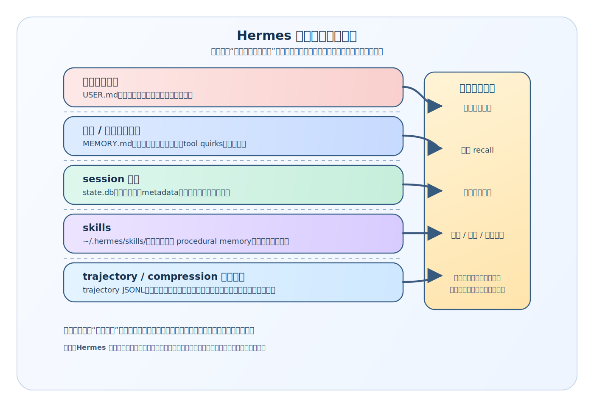

# Hermes 到底把什么存下来了：从静态文件层看它怎样为自我进化准备长期材料

## 先回答这篇最关键的问题

前一篇已经把 Hermes 与 Codex / Claude Code 的主循环差异压清：

- Codex 更像在维持当前 coding work-round
- Claude Code 更像在维持一套 coding runtime
- Hermes 更像在维持一套经验处理内核

但只停在这里还不够。

“经验处理内核”如果不继续往下拆，很容易停在抽象判断：

- 它到底处理了什么经验
- 这些经验有没有留下来
- 如果留下来了，最后以什么形式留下来

这几个问题不回答，Hermes 的“自我进化”仍然只是一种运行时印象：你能看到它这一轮会调 memory、会做 session recall、会存 skill、会压缩上下文，却还看不清这些东西最终落在了哪里。

这篇先把结论立住：

> **Hermes 的自我进化不是一组只存在于运行时的临时能力，而是由一套明确的静态材料层支撑起来的。`MEMORY.md`、`USER.md`、`state.db`、`~/.hermes/skills/`、trajectory JSONL 与 `config.yaml` 一起构成了它的经验落地面。**

先看清这层静态材料，后面再读 memory、session recall、skills、compression，才不会把它们理解成彼此分散的小 feature。

---

## 一、为什么要从“静态文件层”切进去

沿着一般 coding agent 的阅读路径，最先吸引注意力的往往是动态部分：

- `run_agent.py` 里的 conversation loop
- `model_tools.py` 里的 tool dispatch
- `delegate_tool.py` 里的子代理
- `browser`、`terminal`、`execute_code` 这些动作能力

这些当然重要。

但 Hermes 与一般 coding agent 真正拉开差距的地方，不只在于“运行时会做什么”，还在于：

> **它会把哪些东西变成下一次运行还能继续使用的长期材料。**

角度一换，观察重点也会跟着变。

我们不再只关心：

- 这轮任务怎么跑完
- 模型这轮调用了哪些工具
- 哪个回合做了什么动作

而会继续追问：

- 哪些事实被稳定记住了
- 哪些会话被放进了可回忆的历史库
- 哪些做法被升级成以后可复用的 skill
- 哪些运行轨迹被保存下来，供之后分析或训练
- 哪些配置决定了这套经验系统如何工作

这篇关注的不是“这次任务怎么完成”，而是：

> **这次任务结束之后，Hermes 的系统世界里多出了哪些可持续存在的东西。**

---

## 二、先给最低分辨率总图：Hermes 到底把哪些材料落盘了

把 Hermes 的静态材料层压到最低分辨率，可以分成五类：

1. **长期事实层**：`MEMORY.md`、`USER.md`
2. **会话历史层**：`state.db`
3. **程序化做法层**：`~/.hermes/skills/`
4. **经验轨迹层**：trajectory JSONL
5. **运行策略层**：`config.yaml`

这五层分别回答不同问题：



### 1. `MEMORY.md` / `USER.md`：以后还要继续记住什么

`tools/memory_tool.py` 一开头就把边界写得很清楚：

- `MEMORY.md` 保存 agent 的个人笔记、环境事实、项目约定、tool quirks、学到的东西
- `USER.md` 保存对用户的理解：偏好、沟通风格、习惯、期待

而且这些内容不是只存在于某次会话对象里，而是直接落到 profile-scoped 的磁盘目录：

- `get_memory_dir()` 返回 `get_hermes_home() / "memories"`
- 真正文件路径就是 `~/.hermes/memories/MEMORY.md` 与 `~/.hermes/memories/USER.md`

这里可以先立一个判断：

> **Hermes 从一开始就不是把“记忆”理解成某个内存对象，而是理解成一份可长期维护的静态事实资产。**

### 2. `state.db`：过去发生过什么，而且以后还能被按需调回来

`hermes_state.py` 的文件头同样把边界写得很直白：

- 这是一个 SQLite state store
- 用 FTS5 做全文搜索
- 它替代了早期按 session 分散保存的 JSONL 做法
- 它存的是 session metadata、完整 message history，以及 CLI / gateway 会话需要的模型配置

默认路径也很明确：

- `DEFAULT_DB_PATH = get_hermes_home() / "state.db"`

Hermes 并不把旧会话当成“聊完就过去”的东西，而是专门给它们准备了一层长期存在、可检索、可重组的数据库。

### 3. `~/.hermes/skills/`：以后怎么做，不必每次重新悟

`tools/skill_manager_tool.py` 对 skills 的定义很直接：

> **Skills are the agent's procedural memory.**

后面紧接着又补了一句：

- general memory（`MEMORY.md` / `USER.md`）是 broad / declarative
- skills 是 narrow / actionable

这一层也不是抽象概念，而是对应明确目录结构：

```text
~/.hermes/skills/
├── my-skill/
│   ├── SKILL.md
│   ├── references/
│   ├── templates/
│   ├── scripts/
│   └── assets/
```

Hermes 不只把“知道什么”落盘，也把“怎么做某类事”落盘。

### 4. trajectory JSONL：这次运行到底怎么走过来的

`agent/trajectory.py` 的职责更单纯：

- 把完整对话轨迹转成 trajectory entry
- 以 JSONL 形式追加写入文件
- 成功会话默认进 `trajectory_samples.jsonl`
- 失败会话默认进 `failed_trajectories.jsonl`

而 `run_agent.py` 的 `_save_trajectory()` 会在会话完成时把当前 messages 转换后写到这个静态文件里。

这一层和 `state.db` 看起来都像“历史保存”，但两者不是一回事，后面会专门拆开。

### 5. `config.yaml`：系统默认怎样运行这套经验结构

`hermes_cli/config.py` 里 `get_config_path()` 直接返回：

- `get_hermes_home() / "config.yaml"`

而 `DEFAULT_CONFIG` 则把 Hermes 整套运行策略写成了清晰的静态配置树：

- 用哪个模型
- 开哪些 toolsets
- terminal backend 怎么配
- compression 阈值是多少
- browser、checkpoints、auxiliary、gateway timeout 等等怎么跑

所以 `config.yaml` 不是经验正文，但它决定了：

> **Hermes 用什么姿态去处理、保存和继续使用这些经验。**

---

## 三、先把最容易混的边界压清：这些静态材料到底各自在存什么

如果这一层不压清，Hermes 的静态文件层很容易被看成“各种东西都往磁盘里存一点”。

实际不是这样。

它的职责分工相当明确。

## 1. `MEMORY.md` / `USER.md` 存的是 curated long-term facts

`tools/memory_tool.py` 的设计说明里有几句尤其关键：

- 两套 store 都会在 session start 时以 frozen snapshot 形式注入 system prompt
- mid-session writes 会立刻写盘，保证 durable
- 但不会回写当前 session 的 system prompt
- 这样能保持整场会话的 prefix cache 稳定

这组设计说明指向的不是“聊天内容原样落库”，而是另一种材料：

> **经过筛选、值得长期携带的稳定事实。**

所以这一层适合存：

- 用户偏好
- 环境事实
- 项目约定
- 长期有效的工具 quirks
- 用户明确纠正过、以后最好别再犯的事

而不适合存：

- 某次会话里全部来龙去脉
- 某个临时 TODO
- 本轮任务的全部推理过程

这就是 memory 层与 transcript 层的根本边界。

## 2. `state.db` 存的是 session transcript 与检索基础

`hermes_state.py` 的 schema 也说明得很清楚：

- `sessions` 表存会话级元数据
- `messages` 表存逐条消息
- `messages_fts` 是 FTS5 虚拟表
- 通过 trigger 保持全文索引和原始消息同步

文件头甚至直接写明：

- 这是为了 persistent session storage with FTS5 full-text search
- batch runner 与 RL trajectories 不存在这里，是 separate systems

这几句已经把边界钉住：

> **`state.db` 不是 curated memory，而是“过去发生过什么”的完整会话历史底座。**

它服务的是 session recall：先搜，再按 session 聚合，再抽出最相关 transcript，再让便宜模型生成 focused summary。

所以 `state.db` 更像：

- 长期可回忆的会话仓库
- 不是稳定事实手册
- 更不是 procedural memory 仓库

## 3. `~/.hermes/skills/` 存的是程序化做法

skills 这一层最容易被误解成“另一种 memory 文件”，但源码给出的边界并不含糊：

- memory 是 broad / declarative
- skills 是 narrow / actionable

再加上它有这些能力：

- `create`
- `patch`
- `edit`
- `write_file`
- `remove_file`

以及这些约束：

- frontmatter 校验
- 文件大小限制
- 允许的 supporting file 子目录
- security scan

这说明 Hermes 所说的 skill 不是“多一份说明文档”，而是：

> **一份可以继续演化、继续修补、继续复用的操作资产。**

memory 回答的是“要记住什么”；skills 回答的是“以后再遇到这类事，应该怎么做”。

## 4. trajectory JSONL 存的是一次运行的轨迹样本

`agent/trajectory.py` 值得注意的一点，是它保存的 entry 结构不是“供 recall 搜索的聊天数据库”，而是：

- `conversations`
- `timestamp`
- `model`
- `completed`

而 `run_agent.py` 里又明确把它和 `save_trajectories` 开关绑在一起。

trajectory 的用途更偏向：

- 调试
- 复盘
- 数据集样本
- 训练/分析用的 conversation trace

所以它更像“经验轨迹样本层”，不是“在线记忆层”。

## 5. `config.yaml` 存的是运行策略，不是经验正文

这是最容易说歪的一层。

`config.yaml` 当然重要，但它的重要性不在于里面存了用户经验，而在于它决定了 Hermes 以什么方式运行整套经验系统。

例如在 `DEFAULT_CONFIG` 里能看到：

- `toolsets`
- `agent.max_turns`
- `terminal.backend`
- `compression.enabled`
- `compression.threshold`
- `browser.inactivity_timeout`
- `checkpoints.enabled`

这些都不是“记忆内容”，却会直接影响：

- 系统怎样用工具
- 什么时候压缩上下文
- 一次会话能跑多久
- 浏览器和终端怎样介入
- 长历史如何被管理

所以它是**运行策略层**，不是**经验正文层**。

---

## 四、为什么这些静态文件不是附属存档，而是 Hermes 自我进化的物质基础

到这里，读者仍然可能会有一个疑问：

> 好，我知道 Hermes 会落这些文件了。但为什么它们不是普通工程项目里常见的存档、日志、配置和目录结构？

答案在于：

> **Hermes 后续那些最有辨识度的能力，都直接依赖这些静态材料层。**

## 1. 没有 `MEMORY.md` / `USER.md`，就没有稳定的长期事实注入

`tools/memory_tool.py` 里 `load_from_disk()` 会读取两份 markdown，随后立刻捕获 `_system_prompt_snapshot`。

而 `format_for_system_prompt()` 又明确说明：

- 返回的是 load time 捕获的 frozen snapshot
- 不是 live state
- mid-session writes 不影响当前注入内容

memory 的落盘不是“顺手保存一下”，而是下一次 session system prompt 的来源之一。

> **持久记忆之所以能成为主循环前置材料，前提就是它先有稳定、可持续、可维护的静态文件形态。**

## 2. 没有 `state.db`，session recall 就会退化成“翻聊天记录”

`tools/session_search_tool.py` 的开头把流程写得很直接：

1. FTS5 找匹配消息
2. 按 session 分组
3. 取 top N unique sessions
4. 加载每个 session 的 conversation
5. 再生成 focused summary

如果没有 `state.db` 这种可检索、可聚合的持久会话层，Hermes 很难把“以前处理过类似问题吗”做成真正的 recall 系统。

它就会退化成：

- 要么什么都记不住
- 要么把大量原始 transcript 硬塞回当前上下文
- 要么只能做很弱的最近历史回看

所以 `state.db` 不是“顺手留个日志”，而是：

> **第二层记忆系统真正成立的底座。**

## 3. 没有 skills 目录，成功做法就只能停留在经验印象里

skills 最关键的地方不在于“有个 skill hub”，而在于 Hermes 允许 agent 去创建、修补、重写一份正式可复用的程序化资产。

这要求它必须有一个稳定目录层来承载：

- `SKILL.md`
- supporting references
- templates
- scripts
- assets

没有这层目录，所谓“procedural memory”就只能停留在：

- 某次会话里提过
- 某条 summary 里说过
- 模型好像记得一点点

而不会变成可以真正被再次加载、再次执行、再次修补的资产。

## 4. 没有 trajectory 文件，系统就少了一种可离线分析的经验样本层

Hermes 把 trajectory 单独落到 JSONL，而不是塞进 `state.db`，这一点本身就很说明问题。

它在明确区分两件事：

- `state.db` 负责在线 recall / session persistence
- trajectory 文件负责离线复盘 / 样本积累 / 训练分析

这意味着 Hermes 不只在乎“下次我还能不能想起来”，也在准备：

> **这次运行以后，有没有一份结构化轨迹能供后续分析。**

## 5. 没有 `config.yaml`，这些经验系统就不会以稳定方式运行

一个系统要持续积累自己，不能只靠“有存储”，还要靠“有稳定运行策略”。

`config.yaml` 在这里更像控制层：

- 哪些能力默认开
- 怎样压缩上下文
- 终端/浏览器/模型怎么配
- gateway timeout、toolsets、auxiliary 怎么选

它不直接存经验，但决定经验系统是不是一直按同一套规则工作。

所以它不是经验正文，却是经验系统的运行壳。

---

## 五、这里最值得单独强调的一点：Hermes 把“经验”拆成了几种完全不同的静态形态

如果把这篇再压成一句，Hermes 最有价值的地方不在于“它会存东西”，而在于：

> **它知道不同类型的经验，应该被存成不同静态形态。**

这并不常见。

很多系统一旦开始谈“长期记忆”，最后很容易退化成两种粗糙做法：

- 要么全都往向量库里塞
- 要么全都堆进 transcript / log

Hermes 不是这样。

它至少把经验拆成了这些层：

- **稳定事实** → `MEMORY.md` / `USER.md`
- **过去会话** → `state.db`
- **程序化做法** → `~/.hermes/skills/`
- **轨迹样本** → trajectory JSONL
- **运行策略** → `config.yaml`

这种拆法重要，因为每一类材料后续的处理方式都不同：

- 稳定事实要能被直接注入 system prompt
- 会话历史要能被检索、聚合、总结
- 程序化做法要能被 patch、edit、write_file
- 轨迹样本要适合离线分析
- 运行策略要适合被稳定配置和迁移

Hermes 的“自我进化”不是一个大抽屉，而是一套分层材料学。

---

## 六、这也是为什么 Hermes 比一般 coding agent 更像“持续积累自己的系统”

现在可以回到与 coding agent 的比较了。

Codex、Claude Code 当然也会有：

- 配置文件
- 项目规则
- 会话状态
- 各种日志

但 Hermes 特别不一样的地方在于：

> **它明确把“哪些材料会支撑未来继续变强”这件事做成了系统级设计。**

差异不在于“有没有磁盘文件”，而在于这些磁盘文件是否被当成经验系统的一部分。

Hermes 在这里给出的答案显然是肯定的：

- memory 文件会回到后续 system prompt
- `state.db` 会回到 session recall
- skills 目录会回到 skill loading 与程序化复用
- trajectory 会变成轨迹样本
- `config.yaml` 会控制这整套系统默认怎样跑

所以这些静态文件并不是主循环之外的边角料。

它们更像是：

> **Hermes 主循环之所以能越跑越像“经验处理内核”，背后那层真正可落地的材料地基。**

---

## 七、最后收一句：Hermes 的自我进化，首先表现为它有一套明确的静态材料层

如果这篇最后只留一句话，可以是：

> **Hermes 的自我进化之所以不是一句抽象口号，首先是因为它把经验真正落成了几类不同的静态材料：事实、会话、做法、轨迹与配置。主循环只是这些材料被重新利用的地方，磁盘层才是它们持续存在的地方。**

这也是下一篇最自然要继续追的问题：

> 既然 Hermes 已经把长期事实落成了 `MEMORY.md`、`USER.md` 和 frozen snapshot，那为什么它要把这套 memory 直接接进主循环，而不是把它做成一个附属功能？

---

## 系列内继续阅读

- 上一篇：`02-从主循环看-Hermes-与-coding-agent-有什么不同.md`
- 回到阅读入口：`2026-04-16-Hermes-自我进化阅读路线图-v1.md`
- 如果你想回看这组文章为什么这样排：`2026-04-17-Hermes-特色与不同点系列规划-v1.md`
- 下一篇：`04-为什么-Hermes-会把持久记忆直接接进主循环.md`
