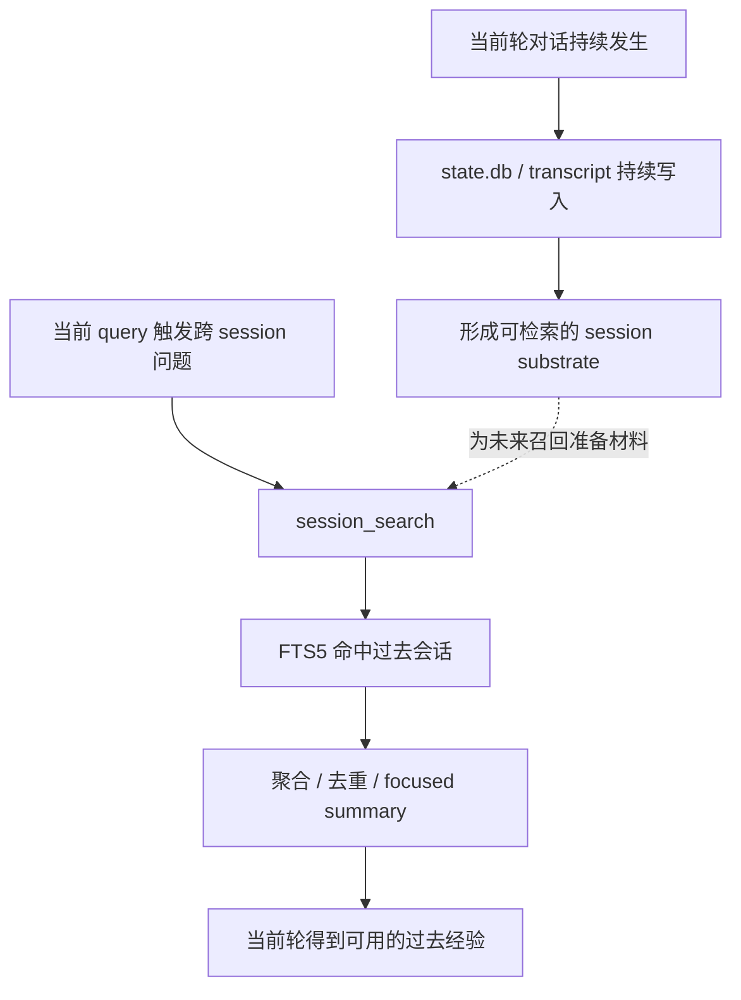

# session recall 为什么不是历史回放，而是按需重构过去经验

## 先回答这篇最关键的问题

上一篇已经把 Hermes 的持久记忆层压清了。

现在问题自然会往前再走一步：

> 既然 Hermes 已经有了 `MEMORY.md`、`USER.md` 这套长期记忆，为什么还要再做一层 `state.db + session_search_tool.py` 的会话回忆系统？

如果只从表面看，这个问题很容易被答歪。

最常见的误解有两个：

- 误解一：既然已经有 memory，就不该再存完整 transcript
- 误解二：既然已经存了完整 transcript，那回忆时直接翻旧聊天记录就行了

Hermes 两条都没选。

它既没有把所有过去经验压进 `MEMORY.md / USER.md`，也没有把 session recall 做成“把原始聊天记录回放一遍”。

它走的是第三条路：

> **把过去会话完整存下来，但真正取用时，不是原样回放，而是先检索、再筛选、再压缩成当前能用的经验。**

如果把这篇先压成一句话，可以先立这个判断：

> **Hermes 不只会“记住事实”，它还会在需要时把过去会话重构成当前真正需要的经验；session recall 解决的是情境回忆，不是固定记忆。**

---

## 一、先把 memory 和 recall 分开：它们根本不是同一层东西

理解 Hermes 的 session recall，第一步不是看数据库，而是先把 memory 和 recall 的边界拆开。

上一篇已经讲过：

- `MEMORY.md` / `USER.md` 存的是长期稳定事实
- 它们在 session start 时作为 frozen snapshot 进入 system prompt
- 它们要的是稳定、可持续、可缓存的背景地板

但这套设计天然不适合另一类信息。

例如：

- 上次我们处理这个 bug 时具体怎么排的
- 那次失败的原因到底是什么
- 哪个目录、哪个命令、哪个报错当时最关键
- 某个项目之前到底讨论过哪些边界判断

这类内容的问题不在于“它值不值得长期携带”，而在于：

> **它只会在某些具体场景下重新变得有用。**

也就是说：

- memory 负责稳定事实
- recall 负责情境回忆

这两层不能混。

如果把情境性很强的旧会话都硬塞进 `MEMORY.md / USER.md`，你会得到一堆越来越长、越来越脏、越来越不稳定的“长期记忆”。

如果反过来，只保留长期事实，不保留会话历史，那系统又会丢掉另一种非常重要的能力：

- 以前到底怎么做过
- 哪次讨论已经把边界压清了
- 哪段过去经验和当前任务最相关

Hermes 的判断是：

> **长期记忆和会话回忆必须并存，但必须各守各的边界。**

---

## 二、`state.db` 的意义不是“留档”，而是给过去经验准备一块可检索底座

这层边界一清楚，再看 `hermes_state.py` 就容易很多。

文件头先把定位说得很直白：

- 这是 SQLite state store
- 提供 persistent session storage with FTS5 full-text search
- 它替代了早期 per-session JSONL file approach
- 存的是 session metadata、full message history、以及 CLI / gateway sessions 的 model configuration

这已经说明，`state.db` 不是“顺手把聊天记录留一份”。

它是 Hermes 专门为过去会话准备的一块长期底座。

更具体地说，它至少回答了三件事：

### 1. 过去的 session 不该散成零碎文件

如果每个 session 只是各自留一个 JSONL，短期当然也能用。

但一旦系统要长期运行，问题会很快出现：

- 要跨 session 搜同一类问题
- 要按来源过滤
- 要按时间排序
- 要把搜索结果重新按 session 聚合
- 要在 compression 触发后继续保留 lineage

这时候“每轮一个文件”的方案就会越来越笨。

所以 Hermes 直接用 SQLite 把它收成一个统一状态库。

### 2. 会话历史不只是 message 列表，而是一种长期运行能力

`hermes_state.py` 的 schema 很能说明问题。

它不是只有一个 messages 表，而是至少区分了：

- `sessions`
- `messages`
- `messages_fts`

其中 `sessions` 里不仅有：

- `id`
- `source`
- `model`
- `system_prompt`
- `started_at`
- `ended_at`

还有：

- `parent_session_id`
- token / cost 相关字段
- title

而 `messages` 里除了 role、content、timestamp，还有：

- tool_call_id
- tool_calls
- tool_name
- finish_reason
- reasoning
- reasoning_details

这说明 Hermes 保留的不是“聊天文本”，而是：

> **一段可追溯、可搜索、可按 session 重新组织的运行历史。**

### 3. `parent_session_id` 说明它考虑的是长期链路，不只是单次对话

`hermes_state.py` 文件头里专门写了一句：

- Compression-triggered session splitting via parent_session_id chains

这句很值钱。

它说明 Hermes 连 compression 导致的 session 切分都考虑到了。

也就是说，它并不是把 session 看成孤立片段，而是允许会话在长期运行里形成 lineage。

这正是长期回忆系统才会关心的问题。

---

## 三、为什么底层一定要是 SQLite + FTS5，而不是简单日志堆积

很多系统也会留聊天历史。

但“留历史”和“能回忆”其实不是一回事。

Hermes 这里真正关键的不是它存了消息，而是它把消息做成了可检索结构。

`hermes_state.py` 里最关键的几段就是：

- `DEFAULT_DB_PATH = get_hermes_home() / "state.db"`
- `CREATE VIRTUAL TABLE IF NOT EXISTS messages_fts USING fts5(...)`
- 以及 insert / delete / update triggers，用来保持 `messages_fts` 与 `messages` 同步

这几段意味着一件很重要的事：

> **Hermes 不把过去会话当 archive，而是当 searchable recall substrate。**

也就是说，它保留过去，不是为了以后“有空再翻”，而是为了以后能快速把有用片段调出来。

### 1. FTS5 解决的是“先找到哪几段旧经验值得看”

session recall 真正难的不是有没有 transcript，而是：

- 面对大量旧消息，先看哪里
- 哪几个 session 值得重新拿出来
- 哪几条消息和当前 query 最相关

FTS5 的价值就在这里。

它先帮 Hermes 做第一层粗召回：

- 按 query 找匹配消息
- 按相关性排序
- 再按 session 聚合

也就是说，回忆的入口不是“打开历史”，而是“先缩小范围”。

### 2. SQLite 解决的是“长期运行里仍能把这些结果组织起来”

如果没有 SQLite 这种结构化底座，Hermes 很难同时做好这些事：

- 全局搜索
- session 维度聚合
- 来源过滤
- current session 排除
- lineage 处理
- recent sessions 浏览

所以底层不是 SQLite 这件事并不只是工程实现细节，而是能力边界本身。

Hermes 要的不是“有历史”，而是“这份历史能被组织成回忆能力”。

---

## 四、`session_search_tool.py` 真正值钱的地方，是它拒绝“原文回放”

如果只做到 `state.db + FTS5`，Hermes 已经比普通日志系统强很多了。

但它还往前多走了一步。

`tools/session_search_tool.py` 文件头把这一点说得非常明白：

- 它先在 SQLite 里做 FTS5 搜索
- 再用 cheap/fast model 总结 top matching sessions
- 返回 focused summaries，而不是 raw transcripts
- 这样可以 keeping the main model's context window clean

这几句其实直接决定了 Hermes 的 recall 气质。

它不是：

- 找到旧 transcript
- 把大段原文直接塞回主模型

而是：

- 先检索
- 再截取相关 session
- 再聚焦总结
- 最后返回“这次真正需要知道的过去经验”

这和“翻聊天记录”已经完全不是一个东西了。

### 1. 回忆不是回放，而是重构

一个人想起过去，也不是把当时每一句话原样重新播放一遍。

真正有用的回忆往往是：

- 当时遇到的是什么问题
- 最后怎么解决的
- 哪几个点最关键
- 这次有什么可以复用

Hermes 的 session recall 本质上也在做这件事。

它把 raw transcript 再加工成当前场景真正能用的经验块。

所以这层更像：

> **检索后的重构**

而不是：

> **原文回放**

### 2. focused summary 是为了把“可搜索的过去”变成“可使用的过去”

`session_search_tool.py` 开头写着：

- Returns focused summaries of past conversations rather than raw transcripts
- keeping the main model's context window clean

这不只是为了省 token。

更关键的是，它在控制经验的形态。

raw transcript 有几个天然问题：

- 太长
- 太脏
- tool output 太多
- 和当前问题不一定等比例相关
- 很容易把上下文窗口直接拖垮

所以 Hermes 在这里不满足于“搜到”，它还要“整理后再给主模型用”。

这也是 recall 系统和普通搜索功能的差别。

普通搜索做到“找到”就结束了。

Hermes 的 recall 要做到：

> **找到之后，把过去压成现在真能用的形状。**

---

## 五、`_HIDDEN_SESSION_SOURCES` 这类设计，说明 recall 不是“什么都回忆”

`session_search_tool.py` 里还有一个很能说明问题的小设计：

- `_HIDDEN_SESSION_SOURCES = ("tool",)`

旁边注释写得也很清楚：

- 第三方集成或工具侧 session 会打上 `tool`
- 它们不应该污染用户的 session history

这件事看起来很小，但其实非常 Hermes。

因为它说明 session recall 不是：

- 只要历史里有，就一律拿来回忆

而是：

- 先判断哪些来源值得进入回忆面
- 哪些来源应该被隐藏
- 哪些 session 虽然存在，但不该进入“用户长期对话经验”这层视野

这意味着 recall 不是纯技术搜索，而是已经带有经验治理了。

也就是说：

> **Hermes 回忆的不是“所有过去”，而是“对当前协作关系真正有意义的过去”。**

这点非常重要。

因为一旦不做这层过滤，长期运行的系统很快就会被大量低价值 session 噪声淹掉。

---

## 六、这也是为什么 current session 要被排除：回忆系统处理的是“过去”，不是“当前上下文”

`session_search_tool.py` 还专门写了一句：

- The current session is excluded from results since the agent already has that context.

这句也很关键。

它说明 Hermes 对 recall 的理解非常干净：

- 当前会话已经在眼前，不需要再回忆
- recall 处理的是当前上下文之外的过去
- 它的职责是把“现在没有，但以前有”的经验带回来

这再次说明 session recall 不是 history browser 的 fancy 版，而是有明确边界的第二层记忆系统。

memory 层负责：

- 长期稳定事实

recall 层负责：

- 当前会话之外、但和当下任务有关的过去经验

这两层一叠起来，Hermes 才会显得像一个真正能长期积累自己的系统。

---

## 七、所以 Hermes 为什么不能只靠 `MEMORY.md / USER.md`

现在可以把最初那个问题重新回答了。

> 既然已经有长期记忆，为什么还要再做会话回忆？

因为 `MEMORY.md / USER.md` 能解决的，是“以后一直要带着什么”。

但它解决不了另一类问题：

- 上次那个复杂问题是怎么一步步处理的
- 某个项目之前讨论过哪几层边界
- 某个错误的上下文细节是什么
- 某段经验只在特定情境下才有价值

这些东西如果都硬塞进 memory，会立刻出问题：

- 记忆文件越来越长
- 稳定事实和情境经验混在一起
- system prompt 越来越脏
- 真正重要的长期偏好反而被埋掉

所以 Hermes 并不是“先有 memory，不够了再补 recall”。

它从设计上就在回答两类不同问题：

- **memory**：系统长期该记住什么
- **recall**：系统在当前任务里该想起什么

前者是静态底座。

后者是按需调回过去经验的动态通路。

---

## 八、最后收一句：session recall 不是翻旧账，而是把过去重新变成当前可用经验

如果把这篇最后只留一句话，我会留这句：

> **Hermes 做 session recall，不是为了把旧聊天记录重新播放给自己看，而是为了把过去会话先检索、再筛选、再总结，最后重构成当前任务真正需要的经验。`state.db + FTS5 + focused summary` 的组合，说明它要的不是“历史可查”，而是“过去可用”。**

这也是下一篇最自然要继续追的问题：

> 如果 memory 让 Hermes 会记住，session recall 让 Hermes 会想起过去，那它真正最像“自我进化”的地方，为什么会落在 skill system 上？

---

## 系列内继续阅读

- 上一篇：`04-为什么-Hermes-会把持久记忆直接接进主循环.md`
- 回到阅读入口：`2026-04-16-Hermes-自我进化阅读路线图-v1.md`
- 如果你想回看这组文章为什么这样排：`2026-04-17-Hermes-特色与不同点系列规划-v1.md`
- 下一篇：`06-为什么-skill-system-才是-Hermes-最像自我进化的地方.md`
