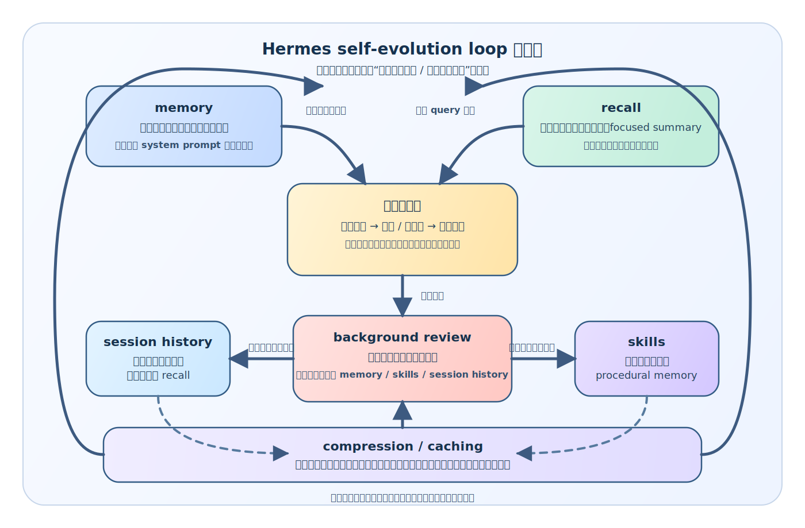

# Hermes 怎样把 memory、recall、skills、compression 接成真正的 self-evolution loop

## 先回答这组最后那个总问题

前面几篇已经把 Hermes 最有辨识度的几层能力一层层拆开了：

- 它有静态材料层
- 它把持久记忆直接接进主循环
- 它把 session recall 做成第二层记忆系统
- 它把 skill system 做成 procedural memory
- 它会在长会话里整理自己的过去
- 它在响应之后还会做 background review，把这轮经验重新审视一遍

单看这些模块，每一层都成立。

但这篇要解决的不是“它还有哪些功能”，而是另一个总问题：

> **这些能力在 Hermes 里，为什么不是并列 feature，而是同一条 self-evolution loop 的不同环节？**

先把结论压出来：

> **Hermes 的特点不在模块多，而在于它让事实、旧经验、做法和历史整理不断回流到下一轮。memory 把稳定事实带回背景层，recall 把相关旧会话拉回当前场景，skills 把成功做法变成以后直接可用的能力，compression 让越来越长的历史还能继续工作，background review 则负责决定这轮里什么值得进入未来。**



后面不用再把每个模块重新讲一遍，而是沿着这条回流链，看它们各自卡在什么位置。

---

## 一、如果只看模块清单，你很容易误读 Hermes

如果只是平铺 Hermes 的源码入口，你会看到：

- `tools/memory_tool.py`
- `tools/session_search_tool.py`
- `tools/skill_manager_tool.py`
- `agent/context_compressor.py`
- `agent/prompt_caching.py`
- `run_agent.py` 里的 background review

这样看很容易把它理解成一个“功能很多”的 agent：

- memory
- recall
- skills
- compression
- caching
- review

这种理解不能说错，但会把 Hermes 读扁。

因为真正重要的不是模块清单，而是这些模块是否接成了回流链。Hermes 不是把过去存成一堆分散材料，而是把过去重新做成下一轮还能用的背景、经验、方法和结构。

所以这一篇的任务，不是重复前面八篇，而是把前面拆开的东西重新装回同一个问题里：

> **过去怎样进入现在，现在怎样再变成未来能力？**

---

## 二、这条 loop 的起点，不是“调用工具”，而是“带着过去进入当前回合”

如果从普通 agent 的视角看主循环，起点通常是：

- 用户发来任务
- 系统开始 deciding tools
- 一路推进到结果

Hermes 的起点更靠前。

在真正进入当前回合之前，它已经先回答了一个问题：过去要怎样进场。

### 1. 持久记忆先进入 system prompt 地板

前面第四篇已经讲过：

- `MEMORY.md` / `USER.md` 通过 frozen snapshot 进入 system prompt
- 它们不是 query-based recall
- 它们是当前会话默认带着的稳定背景

这意味着 Hermes 每轮开始时，不是从零起步，而是带着：

- 对用户的长期理解
- 对环境和项目的稳定事实
- 已确认、以后不该再丢的认知材料

这一层对应的是：

> **先把已经确认过的过去，变成当前回合的认知地板。**

### 2. recall / prefetch 再把与当前 query 最相关的过去调回来

仅有持久记忆还不够，因为很多经验并不是长期背景，而是情境性过去。

这时候 `state.db + session_search_tool.py + prefetch` 的意义就出来了：

- 当前任务相关的旧会话
- 以前处理过的类似问题
- 某次讨论里已经压清的边界判断

会在当前 query 下被召回、聚合、重构，然后重新进场。

所以“过去进入现在”在 Hermes 里其实分成两层：

- 长期稳定事实 → 默认背景
- 情境性旧经验 → 按需召回

Hermes 的主循环不是从零开始，而是从一份已经被过去改写过的起点开始。

---

## 三、当前回合的执行，不只是交付结果，也在制造新的经验材料

Hermes 当然也有普通 agent 的执行层：

- 用户提问
- 推理
- 调工具
- 工具结果回流
- 最终回答

但它不把这一层只当作一次性交付过程。

对 Hermes 来说，当前回合同时还是新经验的生产现场。至少有三类材料会在这里出现：

### 1. 当前任务会暴露新的长期事实

例如：

- 用户新的偏好
- 环境中的新事实
- 项目里新确认的约定
- 某个工具新的 quirk

这些不该停留在这轮聊天里。

### 2. 当前任务会积累新的情境经验

例如：

- 某个 bug 是怎么定位出来的
- 某个任务最后是按什么路径做通的
- 哪段讨论帮助压清了边界

这些未必进入 memory，但会进入可回忆的 session 历史。

### 3. 当前任务还可能形成新的程序化做法

例如：

- 一类任务的稳定处理路径
- 某个复杂工作流的成功套路
- 某个踩坑后修正出来的方法

这些就有机会被升级成 skill。

所以当前回合在 Hermes 里既是执行现场，也是材料生成现场。后面的回流，都是围绕这些材料展开的。

---

## 四、第一条回流，是“事实”回到下一轮地板里

前面第四篇已经说明，Hermes 的 memory 不只是文件存储，而是：

- live state 立即落盘
- frozen snapshot 在下一轮刷新
- 当前 prompt 不乱动
- 下一次 session 再整体带上

把这条链压成最小版本，就是：

```text
这轮暴露了新的稳定事实
  → memory tool 写入 MEMORY.md / USER.md
  → 文件落盘
  → 下次 session start 重新载入 snapshot
  → 事实重新回到 system prompt 背景层
```

这里最关键的不是“能存”，而是“能回到起点”。

这就是第一种回流：

> **事实回流成背景。**

很多系统的 memory 到“留档”就结束了；Hermes 多走了一步，把留档接到了下一轮起跑线。

---

## 五、第二条回流，是“过去会话”在需要时重新变成当前经验

session recall 这一层的回流方式和 memory 不一样。它不是默认带着，而是按需调回。

前面第五篇已经讲过：

- `state.db` 不是 archive，而是 recall substrate
- FTS5 不是日志索引，而是粗召回能力
- focused summary 不是回放，而是重构

这条链可以压成：

```text
这轮产生了新的会话历史
  → session transcript 进入 state.db
  → 以后遇到相关 query 时被 FTS5 命中
  → 再被聚合、总结、重构
  → 变成当前任务真正能用的过去经验
```

这意味着 Hermes 的过去不只是被保存，而是会在需要时重新活过来；而且不是以原文负担的形式活过来，而是以重构后的经验形态活过来。

这就是第二种回流：

> **过去会话回流成情境经验。**

---

## 六、第三条回流，是“做成一次”升级成“以后会做”

如果说 memory 和 recall 让 Hermes 的过去不会白白消失，那么 skill system 则让另一种更高价值的东西开始出现：

> **这次做成的方法，以后不必重新悟。**

这条回流链也很清楚：

```text
这轮任务里形成了可复用做法
  → background review / agent 判断它值得沉淀
  → skill_manage 创建或更新 skill
  → skill 进入 ~/.hermes/skills/
  → 以后通过 skills_list / skill_view / skill_commands 被重新加载
  → 过去学会的做法重新变成当前能力
```

这一条比前两条更像“学习”，因为：

- memory 回流的是事实
- recall 回流的是情境经验
- skill 回流的是行动能力

这就是第三种回流：

> **做法回流成能力。**

到了这一层，Hermes 积累的已经不只是认知材料，而是做事能力。这也是为什么第六篇会把 skill system 看成它最像自我进化的地方。

---

## 七、第四条回流，不是“再记更多”，而是“把越来越多的过去整理成还能继续带着走的形状”

一个系统如果只会不断保存、不断回忆、不断沉淀 skill，很快还会遇到另一个问题：

- 过去越来越多
- 怎么继续带着走

这就是 `context_compressor.py`、`prompt_caching.py` 那一组存在的意义。

前面第七篇已经讲过：

- 保护 head
- 保护 tail
- 总结 middle turns
- pruning old tool outputs
- iterative summary updates
- prompt caching 复用稳定前缀

它们组成的不是单独的“省 token 技巧”，而是另一条回流：

```text
这轮和之前的历史越来越多
  → head/tail 保住关键上下文
  → middle 被整理成 summary
  → previous summary 持续迭代更新
  → caching 让整理后的前缀更低成本保留
  → 过去继续以可运行形态留在后续回合里
```

这就是第四种回流：

> **历史回流成可持续携带的工作形态。**

这一条很关键，因为如果没有它，前面三条回流最后都会被上下文爆炸拖垮。

---

## 八、真正把这些环接起来的关键转折，是 background review

前面四条回流各自成立后，Hermes 已经很特别了。但真正把它们接成系统级循环的关键转折，还要加上 background review。

因为前面那些链路大多解决的是：

- 过去怎么被保存
- 过去怎么被重新拿回来
- 过去怎么被整理

而 background review 解决的是另一个问题：

> **这一轮新发生的东西，怎样被判定为值得进入未来资产？**

没有这一层，系统虽然能使用已有 memory / recall / skills / compression，但它对“刚刚发生的这一轮”仍然缺一个正式沉淀关口。

background review 正是这个关口。它会把：

- 本轮用户透露的长期信息
- 本轮形成的新做法
- 本轮踩坑后的经验修正

重新拿出来问一遍：

- 值得进 memory 吗？
- 值得进 skill 吗？
- 还是只该留在 session history 里？
- 或者根本不值得留下？

所以 background review 不是第五个孤立模块。它更像一个分流阀门：把“刚刚发生的任务过程”送进前面几条回流链里。

---

## 九、现在可以把整条 self-evolution loop 压成一张低分辨率总链了

如果把前面几篇拆开的东西重新压成一条最小主链，Hermes 其实就是这样运转的：

```text
过去已经确认过的长期事实
  → 进入当前 session 的 stable background

过去相关的旧会话经验
  → 在当前 query 下被按需召回

当前任务开始
  → 工具调用 / 推理推进 / 结果交付
  → 本轮产生新的事实、过程、做法、判断

本轮结束后
  → sync 当前回合
  → queue next prefetch
  → background review 判断什么值得留下

值得长期记住的
  → 进入 memory
  → 下轮回流成背景

值得按需调回的
  → 进入 session history
  → 以后回流成情境经验

值得正式复用的方法
  → 进入 skills
  → 以后回流成可调用能力

越来越长的历史
  → 被 compression / caching 整理
  → 继续以低成本形态留在后续回合
```

这一条链一旦看清，Hermes 的“自我进化”就不再神秘了。它不是模型参数在变，而是系统持续把过去转写成未来还能直接使用的东西。

---

## 十、这也是为什么 Hermes 的成长更像 system-level growth，而不是 model-level growth

回到第一篇的总判断，现在这件事已经更清楚了。

Hermes 并没有：

- 在线更新模型权重
- 自动改写底层参数
- 做某种模型层 continual learning

它做的是 system-level growth。也就是：

- 系统带着更多已确认事实开始下一轮
- 系统能从过去会话里更快取回经验
- 系统能把做法变成以后直接可用的能力
- 系统能把越来越多的过去整理成不拖垮自己的形态
- 系统还能在每轮结束后再反思一次什么值得留下

这套增长路径比 model-level 学习更慢一点，但更可控、更可解释、更可审查，也更符合工程系统的现实边界。

所以 Hermes 最有意思的地方，不是它宣称自己“会进化”，而是它把进化拆成了一组能落地、能验证、能持续运行的小回流环。

---

## 十一、最后收一句：Hermes 的特色不是模块多，而是它让过去不断回流成未来能力

如果把这组文章最后只留一句话，我会留这句：

> **Hermes 真正的特色，不在于它拥有 memory、recall、skills、compression、background review 这些模块，而在于它让这些模块形成了一个持续回流的系统：事实回流成背景，会话回流成经验，做法回流成能力，历史回流成可持续工作形态，而每一轮结束后系统还会再判断什么值得进入下一轮。**

---

## 系列内继续阅读

- 上一篇：`08-为什么-Hermes-的主循环收口后还没结束-background-review-才是经验沉淀的关键转折.md`
- 回到阅读入口：`2026-04-16-Hermes-自我进化阅读路线图-v1.md`
- 如果你想回看这组文章为什么这样排：`2026-04-17-Hermes-特色与不同点系列规划-v1.md`
