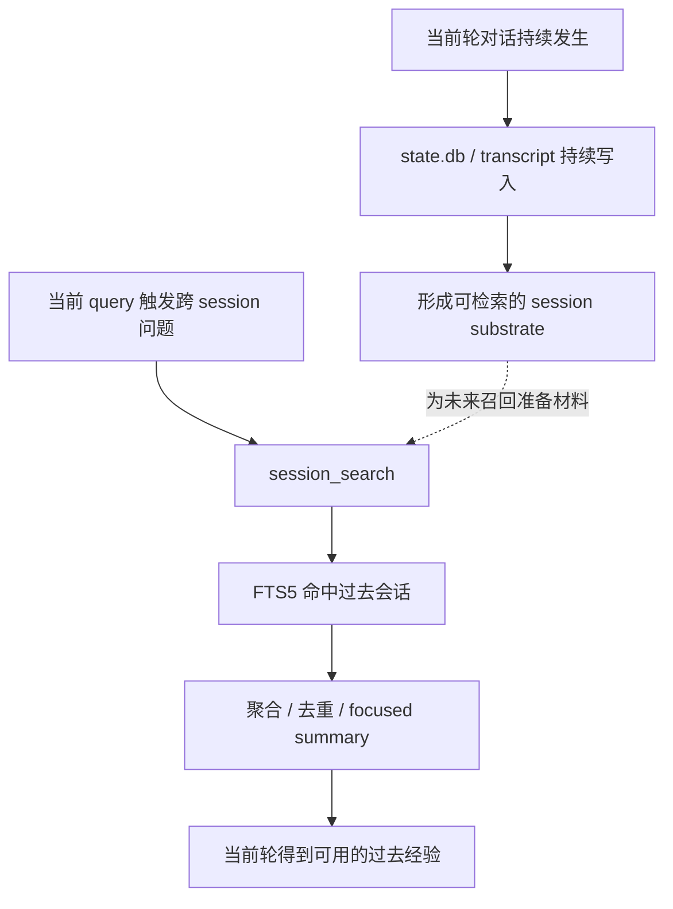
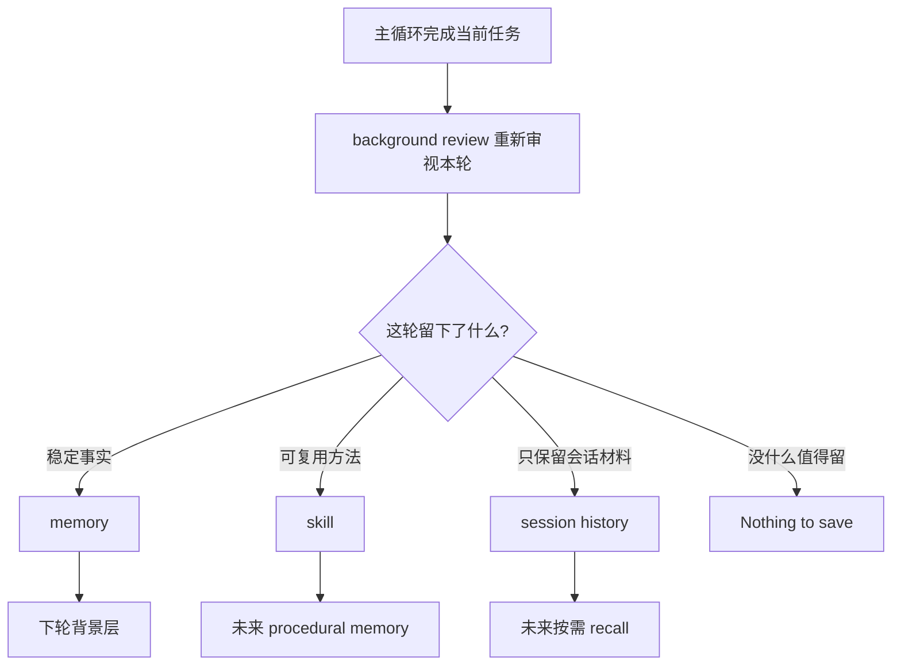
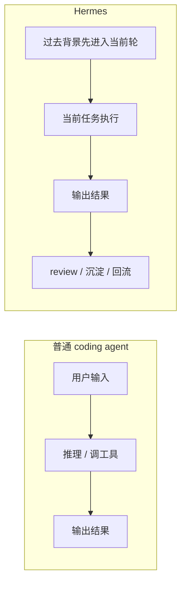
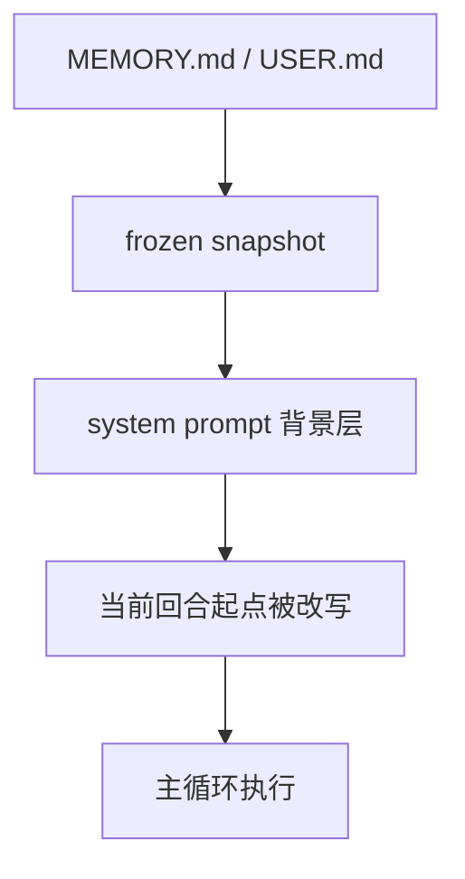
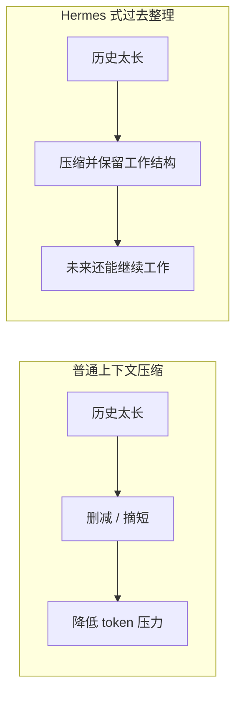

# Hermes Guidebook Diagram Implementation Plan

> **For agentic workers:** REQUIRED SUB-SKILL: Use superpowers:subagent-driven-development (recommended) or superpowers:executing-plans to implement this plan task-by-task. Steps use checkbox (`- [ ]`) syntax for tracking.

**Goal:** 为 `hermes-source-reading` 的 1-9 篇 guidebook 正文补齐高价值图示，并同步精炼第九篇，使整组文章形成更强的结构抓手。

**Architecture:** 采用“两类图并行”的实现方式：Mermaid-first 篇目直接在 Markdown 正文中插入可渲染的 Mermaid 图块；architecture-first 篇目产出 SVG 资产并插入正文。所有变更以 `guidebook/` 为源，同时同步到 `docs/guidebook/` 与 `docs/guidebook/assets/`，最后用 `mkdocs build --strict` 验证站点。

**Tech Stack:** Markdown, Mermaid, SVG assets, MkDocs Material, git

---

## File structure

### Source articles
- Modify: `guidebook/01-为什么-Hermes-不是-有记忆的-agent-而是-能持续积累自己的-agent.md`
- Modify: `guidebook/02-从主循环看-Hermes-与-coding-agent-有什么不同.md`
- Modify: `guidebook/03-Hermes-到底把什么存下来了-从静态文件层看它怎样为自我进化准备长期材料.md`
- Modify: `guidebook/04-为什么-Hermes-会把持久记忆直接接进主循环.md`
- Modify: `guidebook/05-session-recall-为什么不是历史回放-而是按需重构过去经验.md`
- Modify: `guidebook/06-为什么-skill-system-才是-Hermes-最像自我进化的地方.md`
- Modify: `guidebook/07-为什么-Hermes-不只是压缩上下文-而是在整理自己的过去.md`
- Modify: `guidebook/08-为什么-Hermes-的主循环收口后还没结束-background-review-才是经验沉淀的关键转折.md`
- Modify: `guidebook/09-Hermes-怎样把-memory-recall-skills-compression-接成真正的-self-evolution-loop.md`

### Source assets
- Create: `guidebook/assets/hermes-article-01-self-evolution-loop.svg`
- Create: `guidebook/assets/hermes-article-03-static-material-layers.svg`
- Create: `guidebook/assets/hermes-article-09-self-evolution-loop-map.svg`

### Site mirror targets
- Modify: `docs/guidebook/01-为什么-Hermes-不是-有记忆的-agent-而是-能持续积累自己的-agent.md`
- Modify: `docs/guidebook/02-从主循环看-Hermes-与-coding-agent-有什么不同.md`
- Modify: `docs/guidebook/03-Hermes-到底把什么存下来了-从静态文件层看它怎样为自我进化准备长期材料.md`
- Modify: `docs/guidebook/04-为什么-Hermes-会把持久记忆直接接进主循环.md`
- Modify: `docs/guidebook/05-session-recall-为什么不是历史回放-而是按需重构过去经验.md`
- Modify: `docs/guidebook/06-为什么-skill-system-才是-Hermes-最像自我进化的地方.md`
- Modify: `docs/guidebook/07-为什么-Hermes-不只是压缩上下文-而是在整理自己的过去.md`
- Modify: `docs/guidebook/08-为什么-Hermes-的主循环收口后还没结束-background-review-才是经验沉淀的关键转折.md`
- Modify: `docs/guidebook/09-Hermes-怎样把-memory-recall-skills-compression-接成真正的-self-evolution-loop.md`
- Create: `docs/guidebook/assets/hermes-article-01-self-evolution-loop.svg`
- Create: `docs/guidebook/assets/hermes-article-03-static-material-layers.svg`
- Create: `docs/guidebook/assets/hermes-article-09-self-evolution-loop-map.svg`

### Verification
- Run: `python3 -m mkdocs build --strict`

---

### Task 1: 建立图示实现基线与批次边界

**Files:**
- Modify: `docs/superpowers/specs/2026-04-18-hermes-guidebook-diagram-plan-design.md`
- Create: `docs/superpowers/plans/2026-04-18-hermes-guidebook-diagram-implementation.md`

- [ ] **Step 1: 复核 spec 中的批次顺序和图类型，不改动结论，只确认实施顺序**

Run:
```bash
sed -n '188,280p' docs/superpowers/specs/2026-04-18-hermes-guidebook-diagram-plan-design.md
```
Expected: 能看到 Mermaid-first / architecture-first 分工，以及 Batch 1-3 顺序。

- [ ] **Step 2: 确认执行顺序为 Batch 1 → Batch 2 → Batch 3，并把第九篇精炼绑定在 Batch 1 内完成**

Use this decision as the working rule:
```text
Batch 1: 05 / 06 / 08 / 09
Batch 2: 02 / 04 / 07
Batch 3: 01 / 03
Article 09 rewrite happens together with the 09 total-loop figure.
```

- [ ] **Step 3: 提交当前计划文档**

Run:
```bash
git add docs/superpowers/plans/2026-04-18-hermes-guidebook-diagram-implementation.md
git commit -m "add guidebook diagram implementation plan"
```
Expected: plan file committed cleanly.

### Task 2: 完成 Batch 1 Mermaid 图（05 / 06 / 08）

**Files:**
- Modify: `guidebook/05-session-recall-为什么不是历史回放-而是按需重构过去经验.md`
- Modify: `guidebook/06-为什么-skill-system-才是-Hermes-最像自我进化的地方.md`
- Modify: `guidebook/08-为什么-Hermes-的主循环收口后还没结束-background-review-才是经验沉淀的关键转折.md`
- Modify: `docs/guidebook/05-session-recall-为什么不是历史回放-而是按需重构过去经验.md`
- Modify: `docs/guidebook/06-为什么-skill-system-才是-Hermes-最像自我进化的地方.md`
- Modify: `docs/guidebook/08-为什么-Hermes-的主循环收口后还没结束-background-review-才是经验沉淀的关键转折.md`

- [ ] **Step 1: 在第 05 篇插入 session recall 两层结构 Mermaid 图**

Insert this block near the front of both source and docs mirror articles:



- [ ] **Step 2: 在第 06 篇插入 skill 升级路径 Mermaid 图**

Insert this block near the front third of both source and docs mirror articles:


- [ ] **Step 3: 在第 08 篇插入 background review 分流 Mermaid 图**

Insert this block near the first third of both source and docs mirror articles:



- [ ] **Step 4: 同步 05 / 06 / 08 到 docs 镜像**

Run:
```bash
cp guidebook/05-session-recall-为什么不是历史回放-而是按需重构过去经验.md docs/guidebook/
cp guidebook/06-为什么-skill-system-才是-Hermes-最像自我进化的地方.md docs/guidebook/
cp guidebook/08-为什么-Hermes-的主循环收口后还没结束-background-review-才是经验沉淀的关键转折.md docs/guidebook/
```
Expected: docs mirror contains the same Mermaid blocks.

- [ ] **Step 5: 提交 Batch 1 Mermaid 图**

Run:
```bash
git add guidebook/05-session-recall-为什么不是历史回放-而是按需重构过去经验.md \
        guidebook/06-为什么-skill-system-才是-Hermes-最像自我进化的地方.md \
        guidebook/08-为什么-Hermes-的主循环收口后还没结束-background-review-才是经验沉淀的关键转折.md \
        docs/guidebook/05-session-recall-为什么不是历史回放-而是按需重构过去经验.md \
        docs/guidebook/06-为什么-skill-system-才是-Hermes-最像自我进化的地方.md \
        docs/guidebook/08-为什么-Hermes-的主循环收口后还没结束-background-review-才是经验沉淀的关键转折.md
git commit -m "add batch-1 mermaid diagrams"
```
Expected: one commit with 05 / 06 / 08 updated.

### Task 3: 精炼第 09 篇并补总装图

**Files:**
- Modify: `guidebook/09-Hermes-怎样把-memory-recall-skills-compression-接成真正的-self-evolution-loop.md`
- Modify: `docs/guidebook/09-Hermes-怎样把-memory-recall-skills-compression-接成真正的-self-evolution-loop.md`
- Create: `guidebook/assets/hermes-article-09-self-evolution-loop-map.svg`
- Create: `docs/guidebook/assets/hermes-article-09-self-evolution-loop-map.svg`

- [ ] **Step 1: 删掉第 09 篇前半段重复的总论句群**

Apply these edit rules to `guidebook/09-...md`:

```text
- 保留一段“这篇要解决的总问题”作为入口
- 删除重复表达“模块不是并列 feature，而是 loop”的近义段落
- 把抽象判断压缩成更短句子，避免一段里先抽象再抽象再落地
- 让图承担“总装说明书”的结构解释负担
```

Concrete target after edit:
```text
开头 80-120 行内完成：问题提出 → 闭环判断 → 图出现 → 后文分段解释
```

- [ ] **Step 2: 产出第 09 篇总装图 SVG 资产**

Create `guidebook/assets/hermes-article-09-self-evolution-loop-map.svg` expressing this structure:

```text
memory 作为背景地板
recall 作为按需旧经验入口
skills 作为 procedural memory
compression 作为历史整理层
background review 作为分流层
最后回到下一轮主循环
```

Diagram must read as a loop, not a flat module catalog.

- [ ] **Step 3: 在第 09 篇前段插入总装图引用**

Insert this block in both source and docs mirror articles:

```text

```

Place it after the opening problem framing and before detailed section-by-section unpacking.

- [ ] **Step 4: 同步第 09 篇和图资产到 docs 镜像**

Run:
```bash
cp guidebook/09-Hermes-怎样把-memory-recall-skills-compression-接成真正的-self-evolution-loop.md docs/guidebook/
cp guidebook/assets/hermes-article-09-self-evolution-loop-map.svg docs/guidebook/assets/
```
Expected: docs mirror article and asset match the source versions.

- [ ] **Step 5: 提交第 09 篇精炼与总装图**

Run:
```bash
git add guidebook/09-Hermes-怎样把-memory-recall-skills-compression-接成真正的-self-evolution-loop.md \
        docs/guidebook/09-Hermes-怎样把-memory-recall-skills-compression-接成真正的-self-evolution-loop.md \
        guidebook/assets/hermes-article-09-self-evolution-loop-map.svg \
        docs/guidebook/assets/hermes-article-09-self-evolution-loop-map.svg
git commit -m "refine article 09 and add self-evolution loop figure"
```
Expected: text refinement and total-loop figure committed together.

### Task 4: 完成 Batch 2 Mermaid 图（02 / 04 / 07）

**Files:**
- Modify: `guidebook/02-从主循环看-Hermes-与-coding-agent-有什么不同.md`
- Modify: `guidebook/04-为什么-Hermes-会把持久记忆直接接进主循环.md`
- Modify: `guidebook/07-为什么-Hermes-不只是压缩上下文-而是在整理自己的过去.md`
- Modify: `docs/guidebook/02-从主循环看-Hermes-与-coding-agent-有什么不同.md`
- Modify: `docs/guidebook/04-为什么-Hermes-会把持久记忆直接接进主循环.md`
- Modify: `docs/guidebook/07-为什么-Hermes-不只是压缩上下文-而是在整理自己的过去.md`

- [ ] **Step 1: 在第 02 篇插入 Hermes vs coding agent 对照 Mermaid 图**



- [ ] **Step 2: 在第 04 篇插入持久记忆进入主循环 Mermaid 图**



- [ ] **Step 3: 在第 07 篇插入普通压缩 vs Hermes 整理 Mermaid 对照图**



- [ ] **Step 4: 同步 02 / 04 / 07 到 docs 镜像**

Run:
```bash
cp guidebook/02-从主循环看-Hermes-与-coding-agent-有什么不同.md docs/guidebook/
cp guidebook/04-为什么-Hermes-会把持久记忆直接接进主循环.md docs/guidebook/
cp guidebook/07-为什么-Hermes-不只是压缩上下文-而是在整理自己的过去.md docs/guidebook/
```

- [ ] **Step 5: 提交 Batch 2 Mermaid 图**

Run:
```bash
git add guidebook/02-从主循环看-Hermes-与-coding-agent-有什么不同.md \
        guidebook/04-为什么-Hermes-会把持久记忆直接接进主循环.md \
        guidebook/07-为什么-Hermes-不只是压缩上下文-而是在整理自己的过去.md \
        docs/guidebook/02-从主循环看-Hermes-与-coding-agent-有什么不同.md \
        docs/guidebook/04-为什么-Hermes-会把持久记忆直接接进主循环.md \
        docs/guidebook/07-为什么-Hermes-不只是压缩上下文-而是在整理自己的过去.md
git commit -m "add batch-2 mermaid diagrams"
```

### Task 5: 完成 Batch 3 架构图（01 / 03）

**Files:**
- Modify: `guidebook/01-为什么-Hermes-不是-有记忆的-agent-而是-能持续积累自己的-agent.md`
- Modify: `guidebook/03-Hermes-到底把什么存下来了-从静态文件层看它怎样为自我进化准备长期材料.md`
- Modify: `docs/guidebook/01-为什么-Hermes-不是-有记忆的-agent-而是-能持续积累自己的-agent.md`
- Modify: `docs/guidebook/03-Hermes-到底把什么存下来了-从静态文件层看它怎样为自我进化准备长期材料.md`
- Create: `guidebook/assets/hermes-article-01-self-evolution-loop.svg`
- Create: `guidebook/assets/hermes-article-03-static-material-layers.svg`
- Create: `docs/guidebook/assets/hermes-article-01-self-evolution-loop.svg`
- Create: `docs/guidebook/assets/hermes-article-03-static-material-layers.svg`

- [ ] **Step 1: 产出第 01 篇世界观入口图 SVG**

Create `guidebook/assets/hermes-article-01-self-evolution-loop.svg` with this structure:

```text
当前任务 → memory / recall / skills / compression / review → 下一轮
```

The visual emphasis should be “持续积累自己的 agent”, not “功能很多的 agent”.

- [ ] **Step 2: 产出第 03 篇静态材料层分层图 SVG**

Create `guidebook/assets/hermes-article-03-static-material-layers.svg` with these layers:

```text
用户稳定偏好
环境 / 项目稳定事实
session 历史
skills
trajectory / compression 相关材料
```

The visual emphasis should be “不同材料，不同用途”，not a flat file list.

- [ ] **Step 3: 在第 01 / 03 篇插入图引用**

Insert these blocks in source and docs mirror files:

```text

```

```text

```

- [ ] **Step 4: 同步第 01 / 03 篇与资产到 docs 镜像**

Run:
```bash
cp guidebook/01-为什么-Hermes-不是-有记忆的-agent-而是-能持续积累自己的-agent.md docs/guidebook/
cp guidebook/03-Hermes-到底把什么存下来了-从静态文件层看它怎样为自我进化准备长期材料.md docs/guidebook/
cp guidebook/assets/hermes-article-01-self-evolution-loop.svg docs/guidebook/assets/
cp guidebook/assets/hermes-article-03-static-material-layers.svg docs/guidebook/assets/
```

- [ ] **Step 5: 提交 Batch 3 架构图**

Run:
```bash
git add guidebook/01-为什么-Hermes-不是-有记忆的-agent-而是-能持续积累自己的-agent.md \
        guidebook/03-Hermes-到底把什么存下来了-从静态文件层看它怎样为自我进化准备长期材料.md \
        docs/guidebook/01-为什么-Hermes-不是-有记忆的-agent-而是-能持续积累自己的-agent.md \
        docs/guidebook/03-Hermes-到底把什么存下来了-从静态文件层看它怎样为自我进化准备长期材料.md \
        guidebook/assets/hermes-article-01-self-evolution-loop.svg \
        guidebook/assets/hermes-article-03-static-material-layers.svg \
        docs/guidebook/assets/hermes-article-01-self-evolution-loop.svg \
        docs/guidebook/assets/hermes-article-03-static-material-layers.svg
git commit -m "add batch-3 architecture figures"
```

### Task 6: 全量验证与收尾

**Files:**
- Modify: all files created or changed above

- [ ] **Step 1: 检查 1-9 篇是否都至少有 1 张图**

Run:
```bash
python3 - <<'PY'
from pathlib import Path
base = Path('guidebook')
for p in sorted(base.glob('0*.md')):
    text = p.read_text(encoding='utf-8')
    has_img = '![' in text or '```mermaid' in text
    print(p.name, 'OK' if has_img else 'MISSING')
PY
```
Expected: 01-09 全部显示 `OK`。

- [ ] **Step 2: 运行严格构建验证站点**

Run:
```bash
python3 -m mkdocs build --strict
```
Expected: build succeeds with no strict-mode errors.

- [ ] **Step 3: 查看工作区变更并提交最终验证批次**

Run:
```bash
git status --short
```
Expected: only intended guidebook/docs/assets/spec/plan files appear.

- [ ] **Step 4: 提交验证与收尾**

Run:
```bash
git add guidebook docs
git commit -m "verify guidebook diagrams and strict site build"
```

- [ ] **Step 5: 推送并准备给用户验收**

Run:
```bash
git push
```
Expected: branch pushes cleanly and is ready for article-by-article review.
